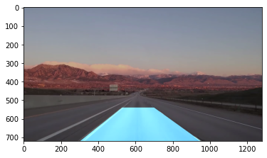

# Lane & Vehicle Detection System

OpenCV image processing pipeline for lane & vehicle detection in autonomous cars

## Image Processing Pipeline

1) Add auto adjustments (auto brightness & contrast) to eliminate color irregularities
2) Convert to grayscale and isolate yellow & white colors
3) Run canny edge detector
4) Create region of interest to reduce surrounding noise
5) Run probabilistic hough line transform
6) Average left-lane lines and right-lane lines into 1 cohesive lane

## Auto Adjustments

In order to clarify our image, we can automatically adjust the brightness using contrast optimization and histogram clipping. This algorithm will then generate α and β automatically based on the clip percent (can increase target brightness by increasing percent).

<p align="center">
  
  
</p>

<p align="center">
  <br>
  &nbsp; &nbsp; &nbsp; &nbsp; &nbsp; BLUE (pre-adjustment) &nbsp; &nbsp; &nbsp; &nbsp; &nbsp; ORANGE (post-adjustment)
</p>

The lane lines are now much more prevalent compared to how blended-in they were previously. This should make it easier later on for canny edge detection to recognize the lines.

## Isolate Yellow & White

Converting from RGB to HSV makes yellow and white shades easier to detect. By doing this, we can simply isolate the yellow and white road markings from the rest of the image (any copious range of colors that covers both light and dark shades should work).

Now, we convert the original frame to grayscale and combine it with the new yellow & white mask.

<p align="center">
  
</p>

The lane lines on this road are unfortunately quite faded, and therefore aren't captured very well by masking procedure. We will make up for this later.

## Canny Edge Detection

We're now ready to run our edge detector. This algorithm is frankly quite brilliant. It was discovered by John Canny (now a professor in the CS department at UC Berkeley, GO BEARS!!), and it's pretty much a step-up from the Sobel Edge Detector.

As a brief summary, ```cv2.Canny()``` runs on slightly blurred, grayscale images and produces pixel values where there is a steep directional derivative. It then thins these edges by finding whether each pixel is a local maximum. After that, it has to decide which edges are useful / which ones we want to keep. A process called hysteresis thresholding helps us weed out these smaller edges while keeping the regular shape of the object intact. Any edge response greater than the high threshold is automatically included, and any edge response smaller than the low threshold is discarded. The edges in between the thresholds are included only if they're connected to the high response edges.

We can simply run ```cv2.Canny(gray_img_mask, 5, 15)``` with a 1 : 3 low to high threshold ratio, as recommended by John Canny himself.

<p align="center">
  
</p>

## Region of Interest (ROI)

Now, we want to cut out a region of interest where we can analyze a portion of our frame. This will be a trapezoidal polygon that mimics a person's FOV when looking out the front windshield.

<p align="center">
  
  <br>
  &emsp; &emsp; <span style="float:left;">MASKED ROI</span> &emsp; &emsp; &emsp; &emsp; &emsp; &emsp; &emsp; &emsp; &emsp; &emsp; &emsp; &emsp; &emsp; &emsp;       &emsp; &emsp; <span style="float:right;">CANNY EDGES ROI</span>
</p>

This shape has to be changed according to the height and depth of the vehicle. In an actual car, a LiDAR sensor would be used to achieve greater accuracy, but for our project, we have to manually alter these values since we are using a dashcam playback.

## Probabilistic Hough Lines

Hough space is tricky concept to grasp. However, the most important thing to understand is that points in XY space correspond to lines in Hough space. We consider pixels as points in XY space, so we can transform them to lines in Hough space. The point where these lines intersect is then translated to a line in XY space. Probabilistic hough lines are an optimized version of the standard hough lines that simply highlight edges of specific length rather than running off to infinity.

We can use this algorithm to highlight the lines in our canny-edged region of interest. We run ```cv2.HoughLinesP()```, and it will output 2 pairs of pixel coordinates (x1, y1) & (x2, y2) per line in our image. ```cv2.line()``` can then draw the corresponding lines given (x1, y1) & (x2, y2) over the initial frame. 

<p align="center">
  
</p>

## Two Master Average Lines

Finally, we want to make a solid line that emulates the road markings on both sides of the lane. All lines with ```slope < 0``` belong to the left side, while those with ```slope > 0``` belong to the right. Also, to ignore any extraneous (horizontal) lines that may have been picked up due to shadows or other obstacles, we should only include lines with ```abs(slope) > threshold```. This threshold value will change as per the ROI mask.

One final precauation is to ensure we always have some lane being recognized (in case of some shoddy canny edge detection). To do this, we'll store the previous line seen in a global ```left_line``` and ```right_line``` variable. This way, we'll still have access to them and can predict where the lane is, even if our program happens to not detect any lines.

<p align="center">
  <br>
  &emsp; The sky blue shading between the two lanes is a nice touch to have.
</p>

### TODO
Unfortunately, this procedure won't work if we want to detect all lanes. I've attempted to group lines based on whether their starting points are "close enough", but it ended up being too inconsistent for each frame, so I never finished it.

<p align="center">
  <br>
</p>

I'll keep this issue as TODO for now as fixing it could help identify lane changes or oncoming traffic in other lanes.

## Results
This lane detection system appears to be pretty accurate and successful in identifying where the driver-side lane is. I tested it across various dashcam footages, and it produced results similar to those of the actual road markings. There are certain conditions that will affect it, however.

* Rain, fog, hail, snow
* Unpaved / fading road markings
* Nighttime
* Heavy traffic

Given the correct sensors and equipment in an autonomous vehicle, it's possible to find a workaround, but these problems can be quite difficult to solve when I only have access to dashcam footage.

## Features to Complete

* Modified frame for canny edge detection and hough lines (Done)
* Cut areas outside region of interest to remove noise (Done - might vary per size of car)
* Created two averaged master lines per frame (Done)
* Filled rectangular area between lines (Done)
* Group according to distance from starting point (TODO)
* Make lines exponential instead of linear for extra lane accuracy (TODO - might not do this)
* Vehicle & traffic sign detection (TODO - deep learning approach; train CNN model)
